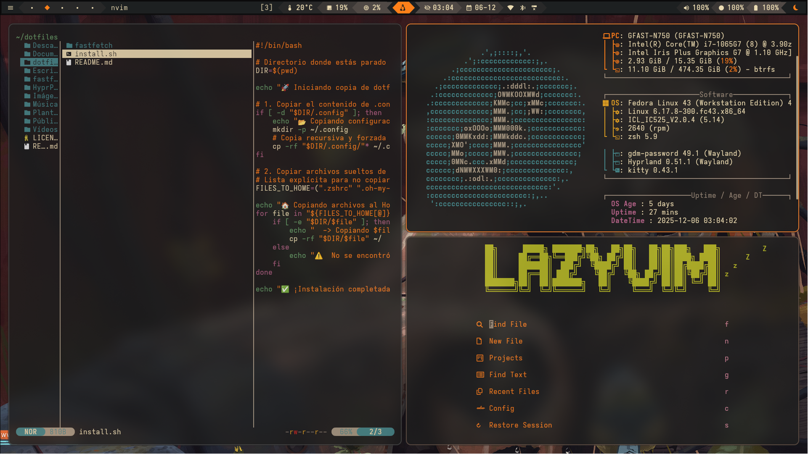

# 🍙 My Dotfiles

> Configuración personal para **Fedora Linux** usando **Hyprland**.




## 🛠️ The Stack

* **OS:** Fedora Linux 🐧
* **Window Manager:** Hyprland
* **Shell:** Zsh + Oh My Zsh
* **Terminal:** Kitty
* **Bar:** Waybar + Mechabar
* **File Manager:** Yazi
* **Editor:** Neovim
* **Theming:** Gruvbox-dark
* **System Info:** Fastfetch

## 🚀 Installación

Clona este repositorio y ejecuta el script de instalación. 

```bash
# 1. Clona el repo
git clone [https://github.com/octaviobenjamin/dotfiles.git](https://github.com/octaviobenjamin/dotfiles.git)
cd dotfiles

# 2. Da permisos de ejecución
chmod +x install.sh

# 3. Instala
./install.sh
